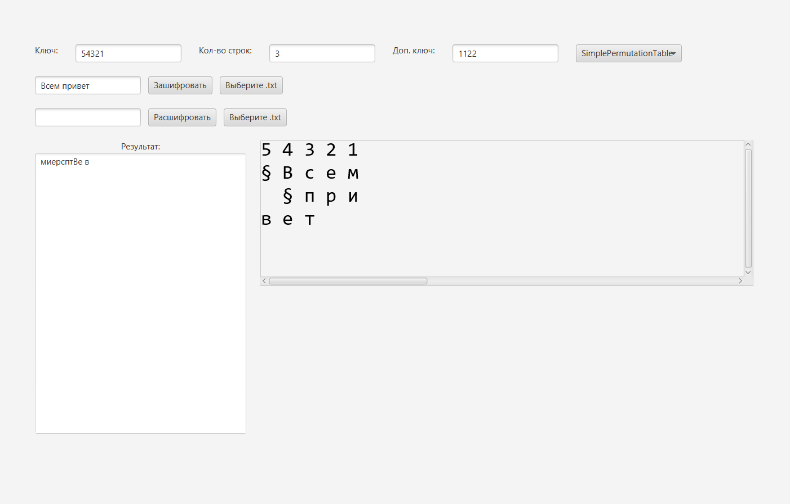

# Программа с интерфейсом по дисциплине "Основы информационной безопасности" [ОИБ] - РУТ (МИИТ)

Написана на Java, для интерфейса использовался инструмент JavaFX.
Для работы программы необходимо установить JavaFX.

Реализованы следующие алгоритмы шифрования:

- Одноалфавитная подстановка - MonoAlphabeticCipher.java
- Многоалфавитная одноконтурная подстановка - PolySingleAlphabeticCipher.java
- Многоалфавитная многоконтурная подстановка - PolyMultiAlphabeticCipher.java
- Многоалфавитная подстановка по таблице Виженера - VigenereCipher.java
- Простая перестановка - SimplePermutationNewCipher.java
- Перестановка, усложнённая по таблице - SimplePermutationTableCipher.java
- Гаммирование - GammaCipher.java
- Алгоритм криптографического преобразования в режиме простой замены - GOST89.java

## Сборка в jar
Из папки с проектом
```
./gradlew shadowJar
```

Для запуска созданного jar
```
java --module-path "C:\Users\USER\javafx-sdk-17.0.8\lib" --add-modules javafx.controls,javafx.fxml,javafx.swing -Djavafx.verbose=true -Dprism.verbose=true -jar cipher-app-0.1.0.jar
```

## Пример работы программы


